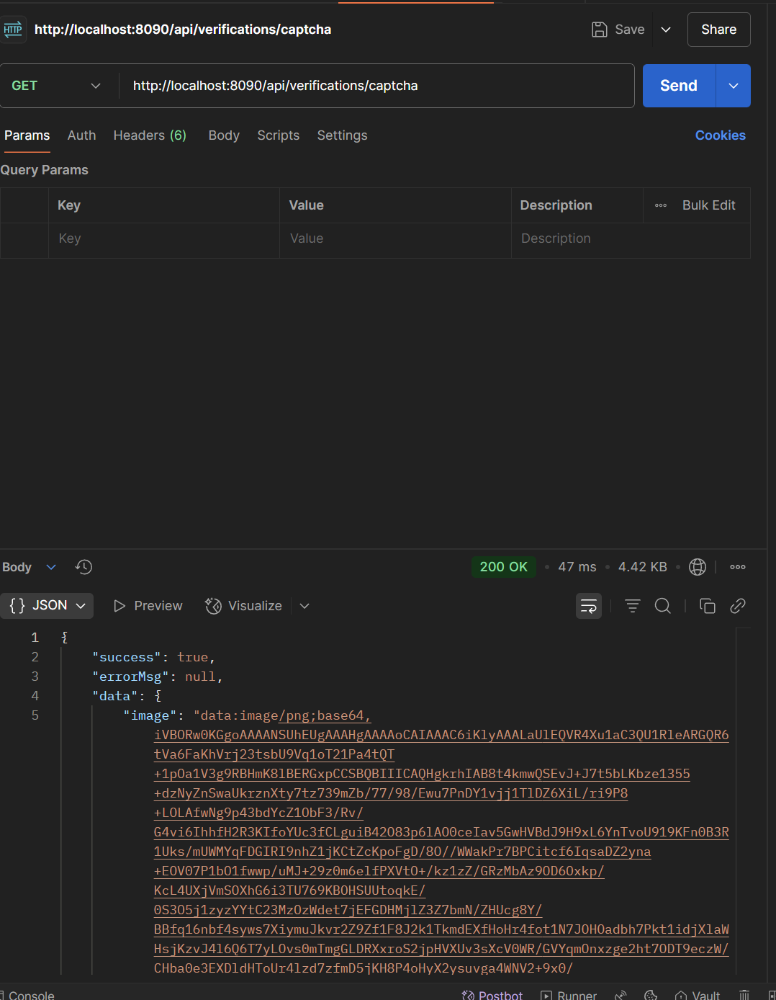
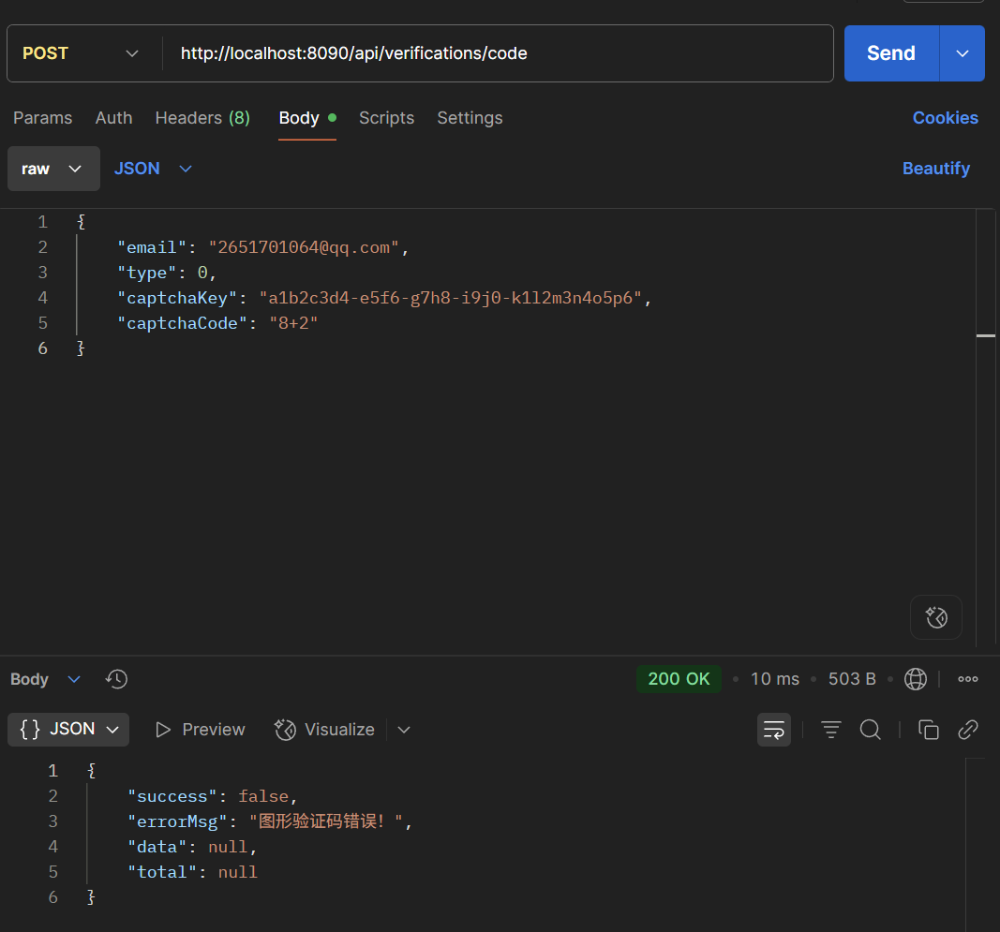
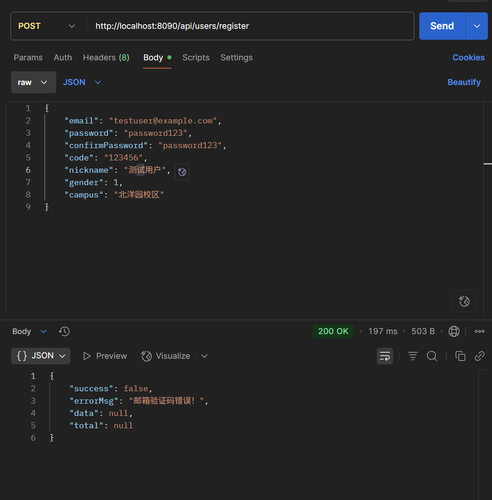
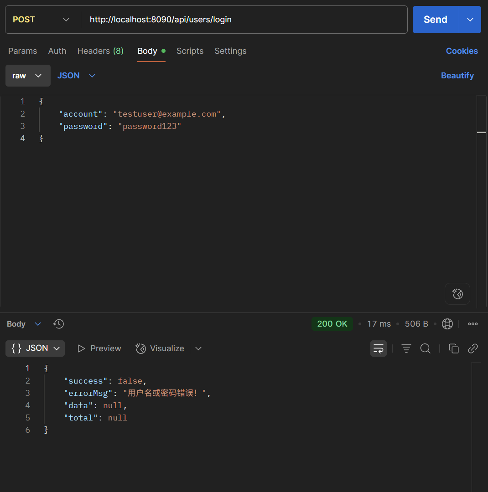
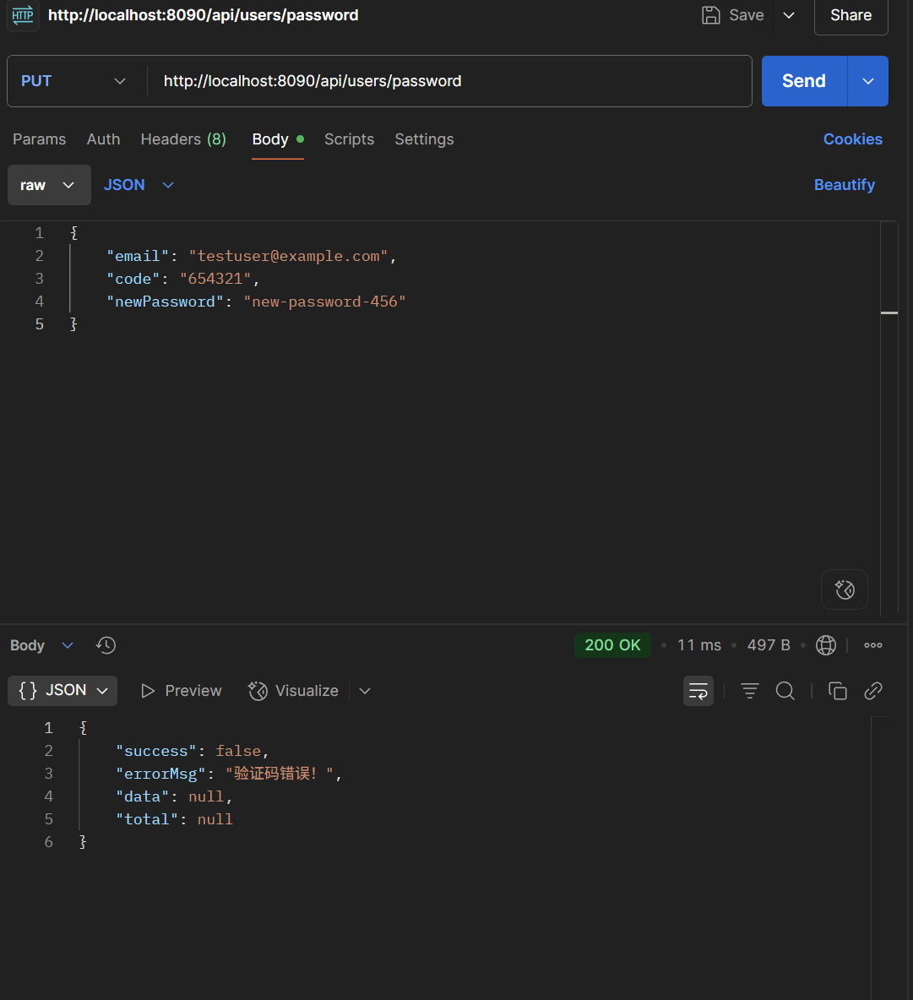

# **TjuFood认证授权API测试文档**

本文档提供了用户认证授权模块所有API的详细信息，包括请求方式、URL、参数和示例，以便于进行接口测试。

**基础URL**: `http://localhost:8090` (您的后端服务地址)

#### **1. 获取图形验证码**

- **功能描述**: 用于获取一个Base64编码的图形验证码图片和其唯一标识`key`。这个`key`在发送邮箱验证码时必须被一同提交。

- **请求方式**: `GET`

- **URL**: `/api/verifications/captcha`

- **请求参数**: 无

- **请求体**: 无

- **成功响应示例** (`200 OK`):

  ```
  {
      "success": true,
      "errorMsg": null,
      "data": {
          "key": "a1b2c3d4-e5f6-g7h8-i9j0-k1l2m3n4o5p6",
          "image": "data:image/jpeg;base64,/9j/4AAQSkZJRgABAQ... (此处为很长的Base64字符串)"
      },
      "total": null
  }
  ```



#### **2. 发送邮箱验证码**

- **功能描述**: 在用户正确输入图形验证码后，向指定邮箱发送一个6位数字的邮箱验证码。

- **请求方式**: `POST`

- **URL**: `/api/verifications/code`

- **请求体** (`application/json`):

  ```
  {
      "email": "2651701064@qq.com",
      "type": 0,
      "captchaKey": "a1b2c3d4-e5f6-g7h8-i9j0-k1l2m3n4o5p6",
      "captchaCode": "8+2"
  }
  ```

  - **参数说明**:
    - `email`: 目标邮箱地址。
    - `type`: 验证码类型。`0` 代表注册，`2` 代表忘记密码。
    - `captchaKey`: 调用上一个接口获取到的图形验证码唯一标识。
    - `captchaCode`: 用户输入的图形验证码答案（对于算术验证码，就是计算结果，例如`10`）。

- **成功响应示例** (`200 OK`):

  ```
  {
      "success": true,
      "data": "验证码发送成功"
  }
  ```

- **失败响应示例** (`200 OK` 但 `success: false`):

  ```
  {
      "success": false,
      "errorMsg": "图形验证码错误！"
  }
  ```



#### **3. 用户注册**

- **功能描述**: 提交所有必需信息，完成新用户的创建。

- **请求方式**: `POST`

- **URL**: `/api/users/register`

- **请求体** (`application/json`):

  ```
  {
      "email": "testuser@example.com",
      "password": "password123",
      "confirmPassword": "password123",
      "code": "123456",
      "nickname": "测试用户",
      "gender": 1,
      "campus": "北洋园校区"
  }
  ```

- **成功响应示例** (`200 OK`):

  ```
  {
      "success": true,
      "data": "注册成功！"
  }
  ```

- **失败响应示例**:

  ```
  {
      "success": false,
      "errorMsg": "邮箱验证码错误！"
  }
  ```



#### **4. 用户登录**

- **功能描述**: 用户通过账号（邮箱或ID）和密码登录，成功后返回一个`token`。

- **请求方式**: `POST`

- **URL**: `/api/users/login`

- **请求体** (`application/json`):

  ```
  {
      "account": "testuser@example.com",
      "password": "password123"
  }
  ```

- **成功响应示例** (返回的`data`字段即为`token`):

  ```
  {
      "success": true,
      "data": "f1g2h3j4-k5l6-m7n8-o9p0-q1r2s3t4u5v6"
  }
  ```

- **失败响应示例**:

  ```
  {
      "success": false,
      "errorMsg": "用户名或密码错误！"
  }
  ```



#### **5. 重置密码**

- **功能描述**: 用户在忘记密码的情况下，通过邮箱和验证码设置新密码。

- **请求方式**: `PUT`

- **URL**: `/api/users/password`

- **请求体** (`application/json`):

  ```
  {
      "email": "testuser@example.com",
      "code": "654321",
      "newPassword": "new-password-456"
  }
  ```

- **成功响应示例** (`200 OK`):

  ```
  {
      "success": true,
      "data": "密码重置成功！"
  }
  ```

- **失败响应示例**:

  ```
  {
      "success": false,
      "errorMsg": "验证码错误！"
  }
  ```



